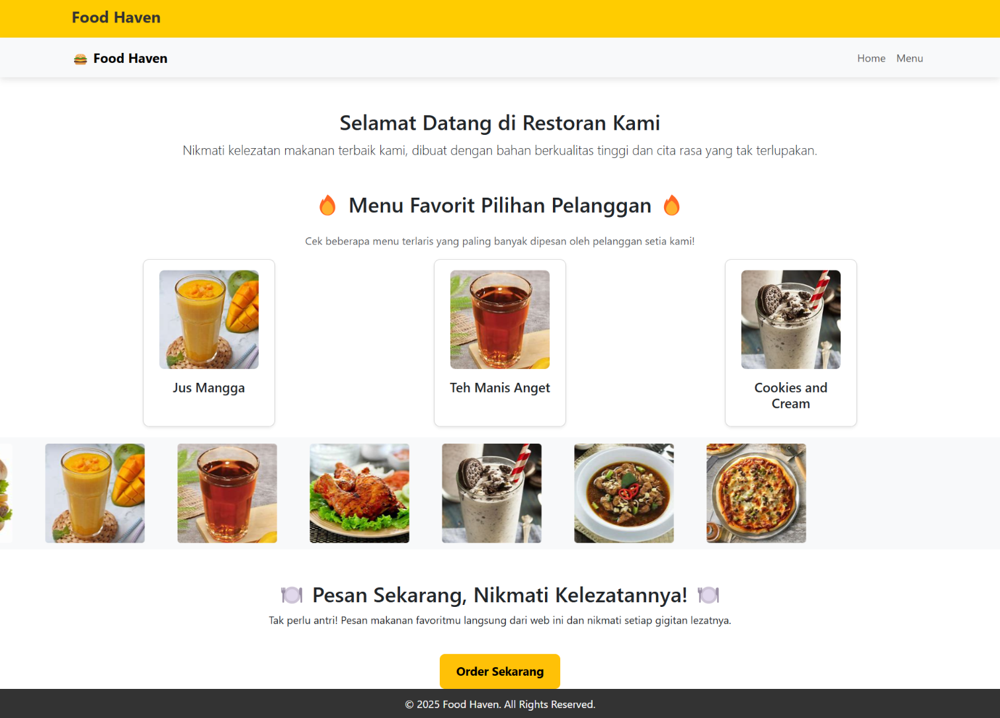
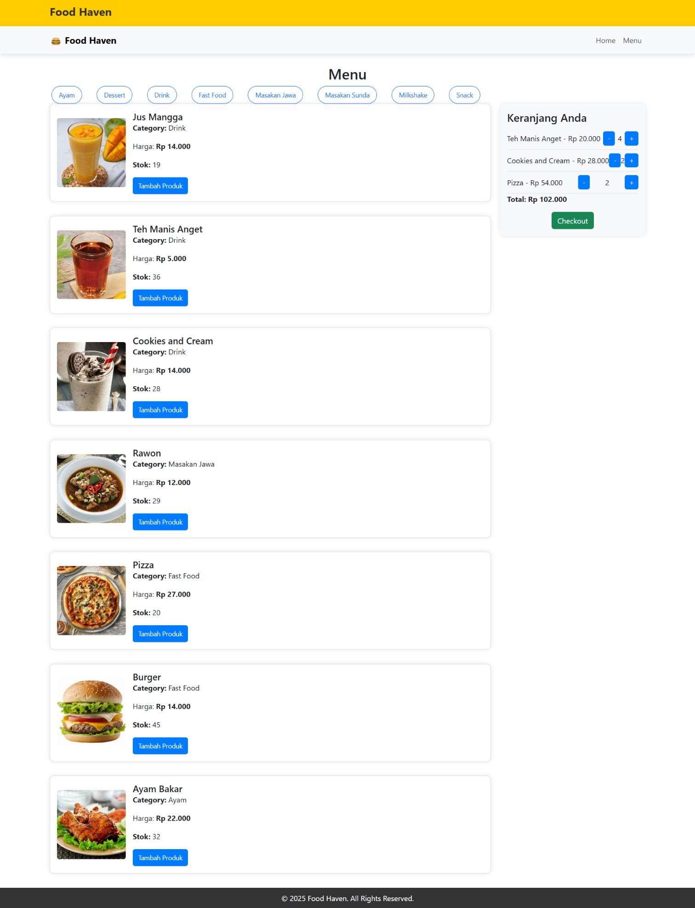
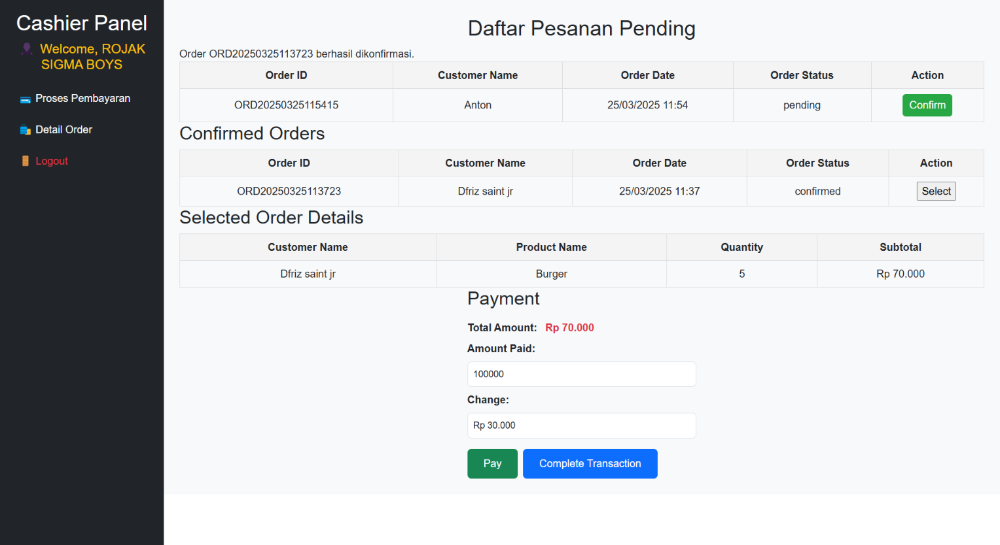
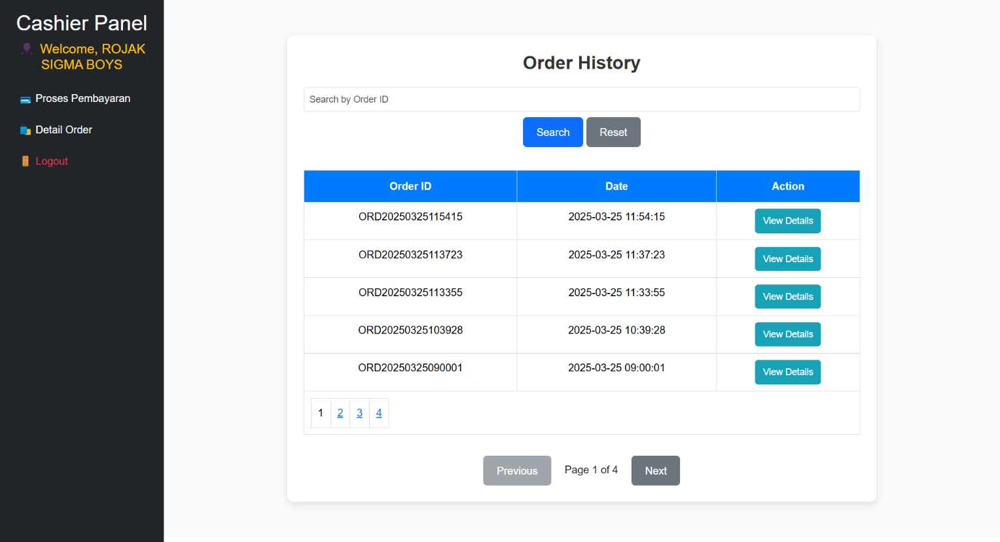
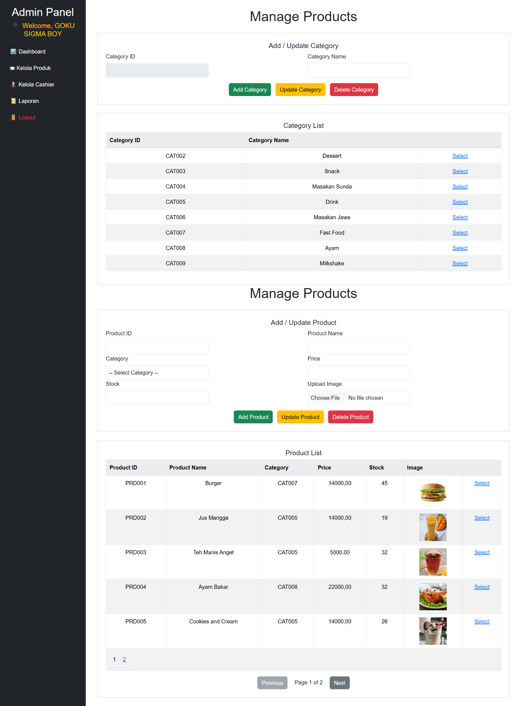
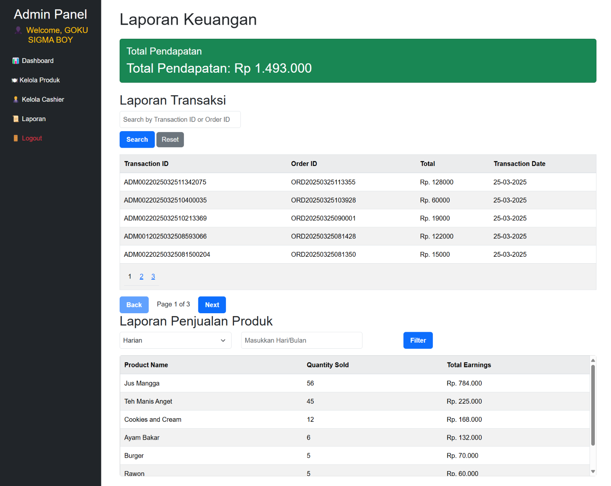

# 🍽️ Food Ordering Management App

An ASP.NET-based Food Ordering Management System that supports three user roles: **Customer**, **Cashier**, and **Admin**. This project is designed to simplify the process of ordering, managing products, and handling transactions in a food service environment.

---

## 📌 Main Features

### 👥 Customer
- View product listings
- Place food orders
- View Receipt

### 🎼 Cashier
- View incoming orders from customers
- Process and complete orders
- Access order history

### 🛠️ Admin
- Manage product categories (Add, Update, Delete)
- Manage products (Add, Update, Delete)
- Manage account User and Admin
- View transaction reports

---

## 🖼️ Application Snapshots

Here are some preview images of the application:

### 🏠 Customer – Homepage


### 🍔 Customer – Product View


### 📅 Cashier – Manage Incoming Orders


### 📊 Cashier – Order History


### 🛒 Admin – Manage Products


### 📈 Admin – View Transaction Reports


---

## ⚙️ Built With

- ASP.NET Web Forms (C#)
- SQL Server
- HTML, CSS, JavaScript
- Bootstrap

---

## 🚀 Getting Started

Follow these steps to run the project locally:

1. **Clone the repository**
   ```bash
   git clone https://github.com/TonAhmad/FoodOrderWebApp.git
   ```

2. **Open the project in Visual Studio**
   - Open the `.sln` file (solution)

3. **Set up the Database**
   - Create a database in SQL Server
   - Import `db_Resto.sql`
   - Update the connection string in `Web.config`:
     ```xml
      	<connectionStrings>
      		<add name="Set"
      			 connectionString="Data Source=.;Database=db_Resto;Integrated Security=True;"
      			 providerName="System.Data.SqlClient"/>
      	</connectionStrings>
     ```

4. **Run the Project**
   - Press `F5` or click the **Start** button in Visual Studio

---

## 📝 Folder Structure

```plaintext
/Project-2
│
├── /Admin
├── /Cashier
├── /Cust
├── /App_Data
├── /Design
├── /Models
├── /ProductImages
├── /screenshots
├── Web.config
└── ...
```

---

## ✍️ Author

- Fathon – [@TonAhmad](https://github.com/TonAhmad)
- Salwa - [@senaxyln](https://github.com/senaxyln)

---

## 📝 License

This project is intended for learning purposes. You are free to use, modify, and enhance it as needed.

---

